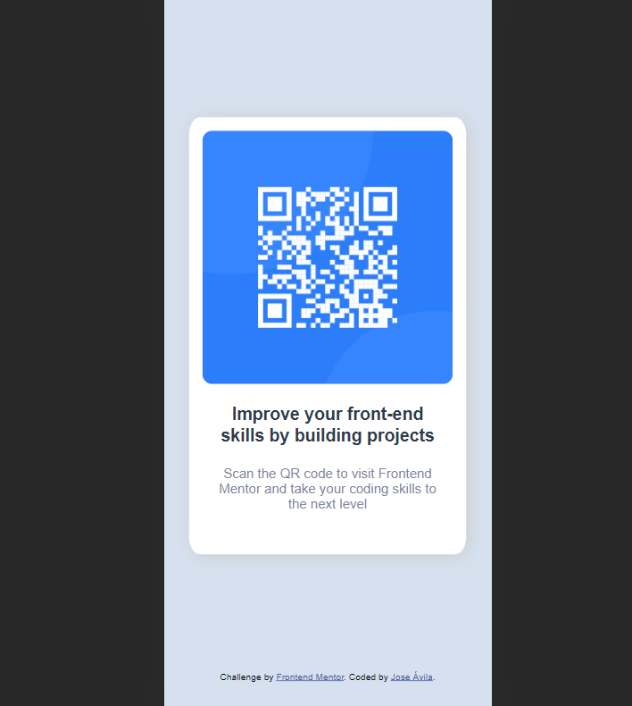

# Frontend Mentor - QR code component solution

This is a solution to the [QR code component challenge on Frontend Mentor](https://www.frontendmentor.io/challenges/qr-code-component-iux_sIO_H). Frontend Mentor challenges help you improve your coding skills by building realistic projects. 

## Table of contents

- [Overview](#overview)
  - [Screenshot](#screenshot)
  - [Links](#links)
- [My process](#my-process)
  - [Built with](#built-with)
  - [What I learned](#what-i-learned)
  - [Continued development](#continued-development)
  - [Useful resources](#useful-resources)
- [Author](#author)
- [Acknowledgments](#acknowledgments)

**Note: Delete this note and update the table of contents based on what sections you keep.**

## Overview

This is my first Frontend Mentor project to put in practice my HTML and CSS skills I learned in the last months. By following these challenges I pretend to develop good practice and better understanding of one of most two important technologies from the web development world.

### Screenshot

### Links

- Solution URL: [Add solution URL here](https://your-solution-url.com)
- Live Site URL: [Add live site URL here](https://your-live-site-url.com)

## My process

### Built with

- Semantic HTML5 markup
- CSS custom properties
- Media Queries

### What I learned

I put in practice the most basic knowledge about CSS Flex I had to keep everything centered, this little component also helped me understanding the importance of not using fixed values so it can reescalate easier when changing size screen.

### Continued development

After developing this little exercise I set my set the goal of making at leat one challenge per week. I made two more that I am about to upload.

### Useful resources

- [MDN](https://developer.mozilla.org/es/) - This helped me for XYZ reason. I really liked this pattern and will use it going forward.
- [W3Schools CSS](https://www.w3schools.com/css/) - Having always a bit code to mess with and make sure of understanding a property comes very handy.

## Author

- Website - [Jose Ávila](https://github.com/javila26)
- Frontend Mentor - [@javila26](https://www.frontendmentor.io/profile/javila26)

## Acknowledgments

Thanks to my coding buddy Ulises who always keep me in the grind of learning new things.
